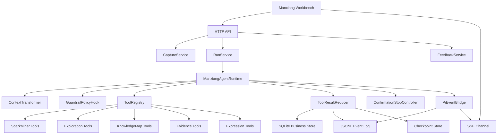

# 慢想 Manxiang V0b Demo TRD

## 1. 文档目的

本文档用于把 `2026-08-05-manxiang-pi-agent-runtime-design.md` 落到第一版可演示 Demo 的技术实现要求。

第一版 Demo 的核心不是做完整产品，而是证明这条链路成立：

```text
用户平时随手收藏文本 / 图片 / 链接
  -> 用户不选题、不写目标，只点“给我点惊喜”
  -> Agent 主动生成灵感卡、意外连接和推文种子
  -> Agent 自动发现探索线程和推荐主线
  -> Agent 生成探索面板、知识地图草稿和表达草稿
  -> Agent 想外部搜索时被护栏拦住
  -> 用户确认后只围绕证据缺口补证据
  -> 事件日志可回放，状态可恢复，测试可证明不是聊天套壳
```

设计理由：

慢想的真实使用场景不是“用户已经想好研究题目”，而是“用户平时收藏了一堆东西，不太想动脑，希望系统主动挖出有意思的连接”。所以第一版 Demo 必须先证明低脑力惊喜模式，再证明可以从灵感升级为严肃探索。

## 2. 术语

| 名称 | 含义 |
|---|---|
| `CaptureItem` | 用户保存的一条文本、图片、链接或混合输入 |
| `SurpriseRun` | 一次“给我点惊喜”的 Agent 运行 |
| `SparkCard` | 灵感卡，一个可直接消费的有趣观察 |
| `TweetSeed` | 可改成推文或短札记的句子 / 标题 / 角度 |
| `ConnectionInsight` | 多条收藏之间的隐性关系 |
| `ExplorationThread` | Agent 发现的可继续深挖的主题线索 |
| `ExplorationBoard` | 探索面板，汇总主线、风险、缺口和停车场 |
| `KnowledgeMap` | 知识地图，严肃深挖后的结构化产物 |
| `EvidenceGap` | 证据缺口，说明哪个结论缺支撑 |
| `ParkingLotItem` | 有价值但暂时偏离主线的分支 |
| `ExpressionDraft` | 表达草稿，如短札记、推文扩写、报告骨架 |

## 3. Demo 范围

### 3.1 必做

- 支持文本、图片、URL、混合输入的收藏入库。
- 支持无 `userNote` 的低阻力收藏。
- 支持小红书链接 metadata 解析失败时仍成功收藏。
- 支持 `POST /v1/surprise-runs` 启动低脑力惊喜模式。
- 支持 Agent 生成至少 3 张 `SparkCard`。
- 支持 Agent 生成至少 3 条 `TweetSeed`。
- 支持 Agent 生成至少 1 个 `ConnectionInsight`。
- 支持 Agent 生成至少 2 条 `ExplorationThread`。
- 支持 Agent 生成 `ExplorationBoard`。
- 支持 Agent 生成 `KnowledgeMap v1`。
- 支持 Agent 生成至少 1 个 `EvidenceGap`。
- 支持 `beforeToolCall` 阻止 `inbox_only` 下的 `search_evidence`。
- 支持用户确认后执行受控 `search_evidence`。
- 支持 `attach_evidence` 后生成 `KnowledgeMap v2`。
- 支持 `draft_expression_variants` 生成至少 2 个表达版本。
- 支持 SSE 事件流和事件日志 replay。
- 支持真实 fixture 驱动的关键测试。

### 3.2 不做

- 不做微信机器人。
- 不做浏览器插件。
- 不做真实外部平台自动发布。
- 不做多用户权限。
- 不做复杂可编辑知识图谱。
- 不做真实完整小红书正文抓取。
- 不做长期风格记忆自动写入。
- 不做生产级向量库。
- 不做无限外部搜索。

## 4. 技术路线

第一版 Demo 可以分两层实现：

| 层 | 目标 | 说明 |
|---|---|---|
| 行为协议层 | 固定 API、事件、状态、工具契约 | 后续替换 runtime 时不改产品协议 |
| Agent 执行层 | 跑通 Agent 工具调用闭环 | V0b 验收必须接 Pi Agent Core / piagent 和真实 LLM |

建议第一版使用：

- 本地 HTTP API。
- SQLite 保存业务状态。
- JSONL 保存事件日志。
- 本地文件保存图片、链接快照 metadata 和 artifacts。
- Pi Agent Core / piagent 作为验收 runtime。
- 真实 LLM 作为集成测试和验收测试依赖。
- fake model / fake provider 只用于单元测试、开发调试和故障定位，不能作为闭环验收依据。

设计理由：

Demo 重点是证明产品行为和 Agent 工程边界，也要证明真实 Agent + 真实 LLM 在低脑力真实输入下可以完成闭环。单元测试需要可重复，所以可以用 fake provider 固定工具调用序列；但 V0b 的 golden 集成测试和最终验收必须使用 Pi Agent Core / piagent 与真实 LLM。fake provider 不能绕过输入，只能基于真实 fixture 的解析结果服务局部测试，不能替代真实闭环测试。

## 5. 总体架构



## 6. 第一版黄金链路

### 6.1 真实验收输入

Demo 必须使用用户真实提供的 6 条收藏作为第一组验收 fixture，不能只用 AI 陪伴等占位固定输入。

| 编号 | 类型 | 内容 | 备注 |
|---|---|---|---|
| `cap_1` | text | 伊莎贝拉和伊丽莎白两个著名的女王有血缘关系。 | 用户的事实性印象，不能直接当事实证据 |
| `cap_2` | text | 普拉多博物馆有很多西班牙王室故事为背景的画作。 | 用户的主题观察 |
| `cap_3` | text | 费利佩和菲利普只是一个英文的不同音译。 | 用户的语言/译名观察，可能需要证据校验 |
| `cap_4` | url | https://www.bjnews.com.cn/detail/173352872819482.html | 真实新闻网页，必须走 URL 解析链路 |
| `cap_5` | mixed | 图片：`docs/superpowers/specs/assets/2026-08-05-spanish-royal-family.png`；用户感想：欧洲真人人有亲缘啊 | 图片 + 用户感想，必须走附件保存和图片摘要链路 |
| `cap_6` | url | https://zhuanlan.zhihu.com/p/300938362；用户感想：伊莎贝拉女王和哥伦布相关，感觉能串起来了 | 真实长文链接，必须走长文 URL 解析 / 摘要链路 |

输入约束：

- 这 6 条必须通过 `POST /v1/captures` 创建，不能直接插 DB。
- 文本内容要原样保存到 `originalText`。
- URL 必须真实调用 `source_adapters`，允许网络失败或 metadata 失败，但 `CaptureItem` 必须保存。
- 长文 URL 解析成功时应生成轻摘要，解析失败时保留 URL 和用户感想，不阻塞收藏。
- 图片必须真实保存为附件，生成 `attachmentIds`，允许 OCR / 视觉摘要失败。
- 图片 OCR / 视觉摘要只能作为 `summary_pending` 参与灵感挖掘，不能直接生成 `EvidenceItem`。
- 用户感想“欧洲真人人有亲缘啊”应标记为 `user_impression`，不能当事实。
- 用户感想“伊莎贝拉女王和哥伦布相关，感觉能串起来了”应作为探索线索，不能直接升级为事实。

### 6.2 用户路径

```text
1. 用户保存 6 条真实验收收藏。
2. 用户打开首页。
3. 用户点击“给我点惊喜”。
4. 前端调用 POST /v1/surprise-runs。
5. 前端订阅 /v1/runs/{runId}/events。
6. Agent 生成灵感卡、推文种子、意外连接。
7. Agent 继续生成探索线程和推荐主线。
8. Agent 生成探索面板和知识地图 v1。
9. Agent 尝试 search_evidence，被 beforeToolCall 阻止。
10. 前端展示确认点。
11. 用户确认补一个证据缺口。
12. Agent 搜索、绑定证据，生成知识地图 v2 和表达草稿。
13. run completed，事件可 replay。
```

### 6.3 必须展示的结果

- 3 张 `SparkCard`。
- 3 条 `TweetSeed`。
- 1 个 `ConnectionInsight`。
- 2 条 `ExplorationThread`。
- 1 条推荐主线。
- 1 个 `ExplorationBoard`。
- `KnowledgeMap v1`。
- 至少 1 个 `EvidenceGap`。
- 1 次被阻止的 `search_evidence`。
- 1 次用户确认。
- 1 条 `EvidenceItem`。
- `KnowledgeMap v2`。
- 2 个 `ExpressionDraft`。
- 可 replay 的事件流。

### 6.4 真实输入下的最低输出方向

Demo 产物不要求逐字固定，但必须能看出 Agent 真的理解了输入材料，至少覆盖这些方向：

- 至少 1 张 `SparkCard` 连接西班牙王室世系图、伊莎贝拉 / 伊丽莎白关系、费利佩 / 菲利普译名问题。
- 至少 1 张 `SparkCard` 连接普拉多博物馆、王室赞助 / 王室叙事、画作背景。
- 至少 1 张 `SparkCard` 连接伊莎贝拉女王、哥伦布、王室资助 / 航海叙事和欧洲王室网络。
- 至少 1 条 `ConnectionInsight` 指出“亲缘关系、王室继承、艺术收藏、译名混乱”之间的意外连接。
- 至少 1 条 `ConnectionInsight` 指出“伊莎贝拉 - 哥伦布 - 西班牙王权 - 博物馆叙事”之间的潜在线索。
- 至少 1 个 `EvidenceGap` 要求验证“伊莎贝拉和伊丽莎白是否有血缘关系”“Felipe / Philip / Philippe 是否只是同名不同语种或音译”或“伊莎贝拉女王和哥伦布的具体关系是什么”。
- `KnowledgeMap v1` 中可以出现“欧洲王室亲缘密集”这类用户印象节点，但 `confidence` 必须是 `user_impression` 或 `hypothesis`。
- `KnowledgeMap v2` 只有在用户确认搜索并 `attach_evidence` 后，才能把某个关系升级为 `fact`。

## 7. 数据模型

### 7.1 CaptureItem

```ts
type CaptureItem = {
  id: string;
  sourceType: "text" | "image" | "url" | "mixed";
  sourceUri?: string;
  sourcePlatform?: "xiaohongshu" | "generic_url" | "unknown";
  originalText?: string;
  userNote?: string;
  aiSummaryDraft?: string;
  userSummary?: string;
  summaryStatus: "summary_pending" | "summary_confirmed" | "summary_rejected";
  parseStatus: "not_parsed" | "metadata_parsed" | "parse_failed";
  attachmentIds: string[];
  candidateTopics: string[];
  createdAt: string;
  updatedAt: string;
};
```

规则：

- `userNote` 强推荐但不强制。
- `summary_pending` 可以低权重参与灵感挖掘。
- `summary_pending` 不能直接升级为事实证据。
- 图片 OCR / 视觉摘要不能直接生成 `EvidenceItem`。

### 7.2 Run

```ts
type AgentRun = {
  id: string;
  mode: "surprise" | "research" | "writing";
  status: "queued" | "exploring" | "waiting_user" | "completed" | "failed" | "aborted";
  autonomyLevel: "inbox_only" | "source_parse_allowed" | "web_search_allowed";
  inputCaptureIds: string[];
  budget: {
    maxTurns: number;
    maxToolCalls: number;
    maxSearchQueries: number;
    maxSourceParses: number;
  };
  createdAt: string;
  updatedAt: string;
};
```

V0b 默认：

```json
{
  "mode": "surprise",
  "autonomyLevel": "inbox_only",
  "budget": {
    "maxTurns": 8,
    "maxToolCalls": 16,
    "maxSearchQueries": 0,
    "maxSourceParses": 0
  }
}
```

### 7.3 SurpriseRun

```ts
type SurpriseRun = {
  runId: string;
  strategy: "recent" | "cross_time" | "contrarian" | "random_walk";
  captureRange: "recent_7_days" | "recent_30_days" | "selected";
  maxCards: number;
  status: "mining" | "completed" | "failed";
};
```

### 7.4 SparkCard

```ts
type SparkCard = {
  id: string;
  runId: string;
  title: string;
  angle: string;
  whyInteresting: string;
  sourceCaptureIds: string[];
  tweetSeedIds: string[];
  surpriseScore: number;
  confidence: "weak" | "medium" | "strong";
  status: "draft" | "shown" | "liked" | "dismissed" | "promoted";
  createdAt: string;
};
```

约束：

- `sourceCaptureIds.length >= 2` 优先，单来源卡允许但降权。
- `whyInteresting` 必须说明“为什么这不是普通总结”。
- 不能出现未来源支撑的事实性断言。

### 7.5 TweetSeed

```ts
type TweetSeed = {
  id: string;
  sparkCardId: string;
  text: string;
  style: "plain" | "sharp" | "warm" | "weird" | "question";
  sourceCaptureIds: string[];
  publishStatus: "draft" | "copied" | "published";
  createdAt: string;
};
```

规则：

- V0b 只支持复制，不支持真实发布。
- `published` 只能由用户手动标记，不能由 Agent 自动写。

### 7.6 ConnectionInsight

```ts
type ConnectionInsight = {
  id: string;
  runId: string;
  relationType: "similarity" | "contrast" | "cause_effect" | "shared_emotion" | "unexpected_bridge";
  claim: string;
  explanation: string;
  sourceCaptureIds: string[];
  confidence: "weak" | "medium" | "strong";
  promotedSparkCardId?: string;
  createdAt: string;
};
```

### 7.7 ExplorationThread

```ts
type ExplorationThread = {
  id: string;
  runId: string;
  title: string;
  coreQuestion: string;
  relatedCaptureIds: string[];
  sourceSparkCardIds: string[];
  status: "candidate" | "active" | "parked" | "promoted" | "archived";
  confidence: "weak" | "medium" | "strong";
  recommendationReason?: string;
  riskNotes: string[];
  createdAt: string;
};
```

### 7.8 ExplorationBoard

```ts
type ExplorationBoard = {
  id: string;
  runId: string;
  recommendedThreadId: string;
  coreQuestion: string;
  linePlan: {
    title: string;
    steps: string[];
    riskNotes: string[];
  };
  sparkCardIds: string[];
  threadIds: string[];
  evidenceGapIds: string[];
  parkingItemIds: string[];
  createdAt: string;
};
```

### 7.9 KnowledgeMap

```ts
type KnowledgeMap = {
  id: string;
  runId: string;
  threadId: string;
  version: number;
  status: "draft" | "confirmed";
  nodes: KnowledgeMapNode[];
  edges: KnowledgeMapEdge[];
  createdAt: string;
};

type KnowledgeMapNode = {
  id: string;
  type: "question" | "claim" | "concept" | "mechanism" | "user_impression";
  title: string;
  summary: string;
  confidence: "hypothesis" | "inference" | "user_impression" | "fact" | "unknown";
  sourceCaptureIds: string[];
  evidenceItemIds: string[];
};
```

规则：

- `generate_knowledge_map` 生成的节点默认不能是 `fact`。
- 只有 `attach_evidence` 后端规则通过后才能升级为 `fact`。

### 7.10 EvidenceGap / EvidenceItem

```ts
type EvidenceGap = {
  id: string;
  runId: string;
  mapNodeId: string;
  question: string;
  whyNeeded: string;
  suggestedQuery: string;
  status: "open" | "search_requested" | "patched" | "dismissed";
};

type EvidenceItem = {
  id: string;
  gapId: string;
  sourceTitle: string;
  sourceUri: string;
  quoteAnchor?: string;
  summary: string;
  strength: "weak" | "medium" | "strong";
  status: "candidate" | "usable" | "rejected";
};
```

### 7.11 ExpressionDraft

```ts
type ExpressionDraft = {
  id: string;
  runId: string;
  mapId: string;
  kind: "short_note" | "tweet_thread" | "outline";
  variantName: "plain" | "sharp" | "warm";
  text: string;
  sourceNodeIds: string[];
  sourceEvidenceIds: string[];
  factBoundary: "knowledge_map_only";
  status: "draft" | "selected" | "rejected" | "revised";
  createdAt: string;
};
```

## 8. API 设计

### 8.1 创建收藏

```http
POST /v1/captures
```

JSON 请求：

```json
{
  "sourceType": "url",
  "sourceUri": "https://www.xiaohongshu.com/explore/example",
  "text": "",
  "userNote": ""
}
```

响应：

```json
{
  "captureId": "cap_123",
  "summaryStatus": "summary_pending",
  "parseStatus": "metadata_parsed",
  "aiSummaryDraft": "这条材料可能和西班牙王室、普拉多博物馆或欧洲王室亲缘有关。",
  "candidateTopics": ["西班牙王室", "普拉多博物馆", "欧洲王室亲缘"]
}
```

验收：

- 缺少 `userNote` 不报错。
- URL metadata 获取失败不报错。
- 图片 OCR 失败不报错。

### 8.2 启动惊喜运行

```http
POST /v1/surprise-runs
```

请求：

```json
{
  "captureIds": ["cap_1", "cap_2", "cap_3", "cap_4", "cap_5", "cap_6"],
  "strategy": "cross_time",
  "maxCards": 3,
  "outputHints": ["spark_cards", "tweet_seeds", "exploration_threads"]
}
```

响应：

```json
{
  "runId": "run_123",
  "status": "exploring",
  "eventsUrl": "/v1/runs/run_123/events"
}
```

### 8.3 灵感卡反馈

```http
POST /v1/spark-cards/{sparkCardId}/feedback
```

请求：

```json
{
  "action": "like",
  "reason": "适合发推"
}
```

规则：

- `like` 提高相似卡片排序权重。
- `dismiss` 降低相似卡片排序权重。
- 反馈只生成 `StyleMemoryCandidate` 或偏好候选，不直接写入长期记忆。

### 8.4 用户确认补证据

```http
POST /v1/runs/{runId}/confirmations
```

请求：

```json
{
  "type": "allow_search_evidence",
  "gapId": "gap_1",
  "maxSearchQueries": 1
}
```

响应：

```json
{
  "runId": "run_123",
  "status": "exploring",
  "autonomyLevel": "web_search_allowed"
}
```

### 8.5 SSE

```http
GET /v1/runs/{runId}/events
```

必须支持：

- `Last-Event-ID`。
- 按 `seq` 补发。
- run 已结束时补发终止事件后关闭连接。

## 9. Agent 工具契约

### 9.1 explore_captures

输入：

```ts
{
  captureIds: string[];
  includePending: boolean;
  maxQuestions: number;
}
```

输出：

```ts
{
  themes: string[];
  tensions: string[];
  questions: string[];
}
```

副作用：无。结果进入模型上下文，不直接落正式状态。

### 9.2 mine_collection_surprises

输入：

```ts
{
  captureIds: string[];
  strategy: "recent" | "cross_time" | "contrarian" | "random_walk";
  maxInsights: number;
}
```

输出：

```ts
{
  connectionInsights: ConnectionInsight[];
}
```

副作用：候选结果由 `afterToolCall` 校验后写入 `ConnectionInsight`。

### 9.3 generate_spark_cards

输入：

```ts
{
  connectionInsightIds: string[];
  maxCards: number;
}
```

输出：

```ts
{
  sparkCards: SparkCard[];
}
```

写状态：

- 写 `SparkCard`。
- 写 `spark.card.created` 事件。
- 写 checkpoint pointer。

### 9.4 draft_tweet_seeds

输入：

```ts
{
  sparkCardIds: string[];
  styles: Array<"plain" | "sharp" | "warm" | "weird" | "question">;
  maxSeedsPerCard: number;
}
```

输出：

```ts
{
  tweetSeeds: TweetSeed[];
}
```

规则：

- 不能新增事实。
- 每条 `TweetSeed` 必须绑定 `sparkCardId` 和 `sourceCaptureIds`。

### 9.5 propose_exploration_threads

输入：

```ts
{
  captureIds: string[];
  sparkCardIds: string[];
  maxThreads: number;
}
```

输出：

```ts
{
  threads: ExplorationThread[];
  recommendedThreadId: string;
}
```

### 9.6 synthesize_exploration_board

输入：

```ts
{
  runId: string;
  recommendedThreadId: string;
}
```

输出：

```ts
{
  explorationBoard: ExplorationBoard;
}
```

### 9.7 generate_knowledge_map

输入：

```ts
{
  threadId: string;
  boardId: string;
  maxNodes: number;
}
```

输出：

```ts
{
  map: KnowledgeMap;
}
```

规则：

- 节点默认 `confidence` 只能是 `hypothesis`、`inference`、`user_impression`、`unknown`。
- 不允许工具直接生成 `fact`。

### 9.8 mark_evidence_gap

输入：

```ts
{
  mapId: string;
  maxGaps: number;
}
```

输出：

```ts
{
  gaps: EvidenceGap[];
}
```

### 9.9 search_evidence

输入：

```ts
{
  gapId: string;
  query: string;
  maxResults: number;
}
```

护栏：

- `autonomyLevel = inbox_only` 时必须 block。
- 必须绑定 `gapId`。
- 不允许无目标搜索。
- 单元测试可以使用 fake search evidence。
- V0b 集成测试和验收测试必须在用户确认后执行真实 `search_evidence` adapter，并把真实返回结果写成 `EvidenceItem`。

### 9.10 attach_evidence

输入：

```ts
{
  gapId: string;
  mapNodeId: string;
  evidence: EvidenceItem;
}
```

写状态：

- 写 `EvidenceItem`。
- 更新 `EvidenceGap.status = patched`。
- 触发 `ConfidenceAssessor`。
- 生成 `KnowledgeMap v2`。

### 9.11 draft_expression_variants

输入：

```ts
{
  mapId: string;
  variants: Array<"plain" | "sharp" | "warm">;
}
```

输出：

```ts
{
  drafts: ExpressionDraft[];
}
```

规则：

- `factBoundary = knowledge_map_only`。
- 不能新增知识地图之外的事实。

## 10. Hook 设计

### 10.1 transformContext

输入上下文必须包含：

- 当前 run 的 `mode`、`status`、`autonomyLevel` 和预算。
- 6 条收藏的轻摘要。
- `summary_pending` 标记。
- 最近已展示的 `SparkCard`。
- 用户轻反馈。
- 当前 `ExplorationThread` 摘要。
- 当前地图摘要。
- 当前证据缺口。
- 禁止动作列表。

设计理由：

Agent 可以自由生成灵感，但必须知道哪些内容只是弱摘要，哪些动作被禁止。

### 10.2 beforeToolCall

必须实现的策略：

| 工具 | 条件 | 结果 |
|---|---|---|
| `search_evidence` | `autonomyLevel = inbox_only` | block |
| `search_evidence` | 缺少 `gapId` | block |
| `publish_tweet` | 任意条件 | block，V0b 不注册真实发布工具 |
| `write_style_memory` | 未经确认 | block |
| `generate_spark_cards` | `mode = surprise` | allow |
| `draft_tweet_seeds` | `mode = surprise` | allow |

连续越权：

1. 第一次 block，返回原因。
2. 第二次 block，注入 `policy_reminder`。
3. 第三次停止 run，状态进入 `waiting_user` 或 `failed_policy`。

### 10.3 afterToolCall

所有写状态工具必须遵守：

```text
Business State + StateEvent + Checkpoint Pointer
```

三者必须在同一事务边界内提交。

如果事件日志失败，业务状态必须回滚。

### 10.4 shouldStopAfterTurn

停止条件：

- Agent 请求被禁止的高风险工具。
- 需要用户确认外部搜索。
- 预算耗尽。
- 已产出 V0b 必需结果。
- 模型连续 3 次越权。
- 工具 reducer 失败。

## 11. SSE 事件

V0b 必须支持这些事件：

```text
run.started
run.status.changed
context.selected
tool.started
tool.completed
tool.blocked
connection.insight.created
spark.card.created
tweet.seed.created
exploration.thread.proposed
line.recommended
exploration.board.created
map.created
evidence.gap.detected
user.input.required
evidence.search.started
evidence.attached
map.updated
expression.draft.created
run.completed
run.failed
```

事件字段：

```ts
type ManxiangEvent = {
  id: string;
  seq: number;
  runId: string;
  type: string;
  payload: unknown;
  createdAt: string;
};
```

## 12. 状态事务

写状态工具需要统一走 `ToolResultReducer`。

示例：`generate_spark_cards`

```text
1. 校验 schema。
2. 校验 sourceCaptureIds 是否存在。
3. 写 SparkCard。
4. 写 spark.card.created 事件。
5. 写 checkpoint pointer。
6. 提交事务。
7. SSE 从 EventLog 推送事件。
```

禁止：

- 工具直接写 DB 绕过事件日志。
- SSE 直接推内存结果。
- 业务状态成功但事件失败。

## 13. 前端最低要求

V0b 前端只需要 5 个区域：

| 区域 | 内容 |
|---|---|
| 收藏入口 | 文本框、URL 输入、图片上传 |
| 惊喜结果流 | `SparkCard`、`TweetSeed`、喜欢 / 不喜欢 / 展开 |
| 探索面板 | 探索线程、推荐主线、风险、停车场 |
| 知识地图 | 文本树视图即可，不做复杂图编辑 |
| Agent 过程流 | SSE 事件列表，展示工具调用和阻止原因 |

第一版不追求漂亮，但必须能一眼看出：

- Agent 做了什么。
- 哪些结果来自哪些收藏。
- 哪个动作被护栏阻止。
- 用户下一步可以确认什么。

## 14. 测试计划

测试分三层：

| 层级 | runtime / model | 用途 | 是否作为 V0b 闭环验收 |
|---|---|---|---|
| 单元测试 | fake provider / fake search | 验证服务、schema、reducer、护栏和事务边界 | 否 |
| Pi Agent 集成测试 | Pi Agent Core / piagent + 真实 LLM + 真实 fixture | 验证真实 Agent 工具调用闭环 | 是 |
| 手工验收 | 前端 + API + Pi Agent Core / piagent + 真实 LLM | 验证真实用户路径和可演示性 | 是 |

原则：

- fake provider 只能证明局部逻辑正确，不能证明慢想闭环成立。
- 所有闭环类测试必须使用 6.1 的真实输入 fixture。
- 真实 LLM 输出允许有表达差异，但必须满足结构化数量、来源绑定、护栏、证据升级和 replay 等硬性断言。
- 如果真实 LLM 没有主动调用某个必需工具，测试不能直接改用 fake provider 兜底；应通过系统提示、tool choice 约束、运行预算或 stop controller 调整真实 Agent 流程。

### 14.1 单元测试

#### capture_accepts_missing_user_note

验证：

- 只传真实 URL 或真实图片也能收藏成功。
- `summaryStatus = summary_pending`。
- 不生成 `EvidenceItem`。

#### source_adapter_keeps_url_when_metadata_fails

验证：

- 对 `https://www.bjnews.com.cn/detail/173352872819482.html` 走真实 URL adapter。
- 对 `https://zhuanlan.zhihu.com/p/300938362` 走真实 URL adapter，并按长文处理。
- metadata 成功时保存 title / description 等轻 metadata。
- metadata 失败或网络不可用时不阻塞收藏。
- `CaptureItem` 仍保存。
- `parseStatus = metadata_parsed` 或 `parse_failed`，但不能跳过 adapter。
- 长文正文抓取成功时允许生成 `aiSummaryDraft`，失败时仍保存 URL 和用户感想。

#### image_capture_keeps_attachment_and_user_impression

验证：

- 上传 `docs/superpowers/specs/assets/2026-08-05-spanish-royal-family.png`。
- `attachmentIds.length >= 1`。
- 用户感想“欧洲真人人有亲缘啊”保存为 `userNote` 或等价字段。
- OCR / 视觉摘要失败时仍保留附件和用户感想。
- 不生成 `EvidenceItem`。

#### surprise_run_generates_sparks_and_tweet_seeds

验证：

- 输入必须是 6.1 的 6 条真实验收收藏。
- fake model 调用 `mine_collection_surprises`，仅用于验证 reducer 和事件写入。
- fake model 调用 `generate_spark_cards`，仅用于验证 reducer 和事件写入。
- fake model 调用 `draft_tweet_seeds`，仅用于验证 reducer 和事件写入。
- DB 里至少 3 张 `SparkCard` 和 3 条 `TweetSeed`。
- 事件日志包含对应 created 事件。
- 至少 1 张 `SparkCard.sourceCaptureIds` 同时包含图片收藏和至少 1 条文本收藏。
- 至少 1 张 `SparkCard.sourceCaptureIds` 包含长文链接 `cap_6`。
- 至少 1 条 `TweetSeed` 反映王室亲缘、博物馆画作或译名混淆之一，不能是与输入无关的泛泛金句。

#### guardrail_blocks_search_when_inbox_only

验证：

- fake model 请求 `search_evidence`，仅用于稳定触发护栏分支。
- `beforeToolCall` block。
- 搜索工具没有执行。
- 事件日志出现 `tool.blocked`。

#### after_tool_call_persists_state_event_checkpoint_atomically

验证：

- 模拟事件日志写入失败。
- 业务状态回滚。
- SSE replay 不出现不可回放状态。

#### evidence_can_upgrade_claim_only_after_attach

验证：

- `generate_knowledge_map` 不能生成 `fact`。
- `attach_evidence` 后，满足规则的节点才能升级为 `fact`。
- 对“伊莎贝拉和伊丽莎白有血缘关系”“费利佩和菲利普只是不同音译”“伊莎贝拉女王和哥伦布相关”等断言，未补证据前只能是 `hypothesis` / `user_impression` / `inference`。

#### fake_provider_must_depend_on_real_fixture_content

验证：

- fake provider 可以固定工具调用顺序，但必须读取 capture 内容或 capture 解析摘要。
- 如果把 6.1 的 6 条输入替换成无关文本，测试不能仍然产出西班牙王室相关固定结果。
- 如果删除图片附件，图片相关 `SparkCard` 或 `ConnectionInsight` 必须降级、消失或标记弱置信度。
- 如果删除 `cap_6` 长文链接，伊莎贝拉 - 哥伦布相关 `SparkCard` 或 `EvidenceGap` 必须降级、消失或标记弱置信度。

### 14.2 Pi Agent 集成测试

测试名：

```text
piagent_real_llm_v0b_surprise_to_research_flow
```

步骤：

1. 通过 API 创建 6.1 的 6 条真实验收收藏，其中 1 条图片、1 条真实新闻链接、1 条真实长文链接。
2. 不确认摘要，不填写目标。
3. 调用 `POST /v1/surprise-runs`。
4. RunService 启动 Pi Agent Core / piagent runtime。
5. 真实 LLM 基于真实 capture 内容选择并调用工具。
6. 校验真实 LLM 至少调用过 `explore_captures`、`mine_collection_surprises`、`generate_spark_cards`、`draft_tweet_seeds`、`propose_exploration_threads`、`synthesize_exploration_board`、`generate_knowledge_map`、`mark_evidence_gap`。
7. 校验灵感卡、推文种子、意外连接和输入材料有关。
8. 校验探索线程、探索面板、地图 v1。
9. 真实 LLM 请求 `search_evidence`。
10. 校验被 `beforeToolCall` 阻止。
11. 调用确认接口允许补证据。
12. 真实 Agent 继续运行，执行真实 `search_evidence` adapter 和 `attach_evidence`。
13. 校验真实 `EvidenceItem.sourceUri`、`sourceTitle`、`summary` 存在。
14. 校验地图 v2 和表达草稿。
15. 校验 SSE replay 与事件日志一致。

硬性断言：

- 测试环境必须配置真实 LLM 凭证和 Pi Agent Core / piagent runtime。
- 测试日志必须记录模型名、runId、工具调用序列和事件 seq 范围。
- 不允许在这个测试里切换到 fake provider。
- 真实 LLM 输出可以不逐字匹配示例，但必须满足 6.4 的最低输出方向。
- 测试失败时保留事件日志、模型输入摘要、工具调用结果和最终 artifacts，方便定位是提示词、工具、护栏还是模型输出问题。

### 14.3 fake 回归集成测试

测试名：

```text
fake_v0b_protocol_regression_flow
```

用途：

- 快速验证 API、状态机、事件日志、checkpoint 和 reducer 没有坏。
- 作为本地开发 smoke test。
- 不作为 V0b 闭环完成标准。

步骤：

1. 通过 API 创建 6.1 的 6 条真实验收收藏。
2. fake provider 基于真实 capture 内容依次触发工具。
3. 校验灵感卡、推文种子、意外连接和输入材料有关。
4. 校验探索线程、探索面板、地图 v1。
5. fake provider 请求 `search_evidence`。
6. 校验被 `beforeToolCall` 阻止。
7. 调用确认接口允许补证据。
8. 执行 fake search 和 attach。
9. 校验地图 v2 和表达草稿。
10. 校验 SSE replay 与事件日志一致。

### 14.4 手工验收

验收时只按这句话判断：

```text
用户不想动脑，只丢收藏并点“给我点惊喜”，系统能给出有趣卡片；
如果用户想深挖，系统能继续生成地图；
如果 Agent 想越权搜索，系统会停下来问用户。
```

## 15. Demo 数据

下面样例只用于说明输出质量和结构，不代表 Pi Agent 集成测试要逐字匹配。真实 LLM 输出可以不同，但必须绑定真实 `sourceCaptureIds`，并满足 6.4 和 14.2 的硬性断言。

### 15.0 Capture Fixture

```json
[
  {
    "id": "cap_1",
    "sourceType": "text",
    "originalText": "伊莎贝拉和伊丽莎白两个著名的女王有血缘关系。"
  },
  {
    "id": "cap_2",
    "sourceType": "text",
    "originalText": "普拉多博物馆有很多西班牙王室故事为背景的画作。"
  },
  {
    "id": "cap_3",
    "sourceType": "text",
    "originalText": "费利佩和菲利普只是一个英文的不同音译。"
  },
  {
    "id": "cap_4",
    "sourceType": "url",
    "sourceUri": "https://www.bjnews.com.cn/detail/173352872819482.html"
  },
  {
    "id": "cap_5",
    "sourceType": "mixed",
    "sourceUri": "docs/superpowers/specs/assets/2026-08-05-spanish-royal-family.png",
    "userNote": "欧洲真人人有亲缘啊"
  },
  {
    "id": "cap_6",
    "sourceType": "url",
    "sourceUri": "https://zhuanlan.zhihu.com/p/300938362",
    "userNote": "伊莎贝拉女王和哥伦布相关，感觉能串起来了"
  }
]
```

### 15.1 SparkCard 示例

```json
{
  "title": "一张王室世系图，把女王、哥伦布、博物馆和译名问题串起来了",
  "angle": "royal_family_as_hidden_index",
  "whyInteresting": "文本里分别提到女王血缘、普拉多王室画作和费利佩/菲利普译名，图片提供西班牙王室继承线索，长文又把伊莎贝拉和哥伦布拉进来；它们合在一起不是单点总结，而是在提示“王权网络”可能是一把理解欧洲历史材料的索引。",
  "sourceCaptureIds": ["cap_1", "cap_2", "cap_3", "cap_5", "cap_6"],
  "surpriseScore": 0.86,
  "confidence": "medium"
}
```

### 15.2 TweetSeed 示例

```json
{
  "text": "欧洲王室史最迷人的地方之一，是你以为自己在看一张家谱，结果它突然连到了哥伦布、博物馆、国王名字和一堆画作背景。",
  "style": "sharp",
  "sourceCaptureIds": ["cap_2", "cap_3", "cap_5", "cap_6"]
}
```

### 15.3 ExplorationThread 示例

```json
{
  "title": "欧洲王室亲缘如何影响我们理解博物馆里的画",
  "coreQuestion": "如果王室成员之间大量通婚、继承和联姻，普拉多这类博物馆中的画作背景，以及哥伦布航海这样的历史事件，会不会都能被放进一张王权关系网里理解？",
  "relatedCaptureIds": ["cap_1", "cap_2", "cap_4", "cap_5", "cap_6"],
  "recommendationReason": "这条线同时连接了用户感想、王室世系图、博物馆画作、真实新闻链接和伊莎贝拉-哥伦布长文，最适合从灵感升级为探索。",
  "riskNotes": ["容易把用户印象直接当事实，需要先验证具体人物关系、哥伦布与伊莎贝拉的关系、画作背景。"]
}
```

## 16. 实现拆分

### 16.0 建议目录结构

如果第一版先在当前 Python demo 仓库实现，建议用下面的模块边界。V0b 验收版本必须接入 Pi Agent Core / piagent；fake provider 只保留为本地单元测试和回归调试入口。

```text
app/manxiang/
  __init__.py
  schema.py              # Pydantic / dataclass 数据模型
  storage.py             # SQLite + JSONL 事件日志
  capture.py             # CaptureService 和轻解析
  source_adapters.py     # GenericUrl / Xiaohongshu / Fallback
  runs.py                # RunService / SurpriseRun / confirmation
  context.py             # transformContext 等价逻辑
  guardrails.py          # beforeToolCall 策略
  reducers.py            # afterToolCall 状态归档
  stop.py                # shouldStopAfterTurn 策略
  tools.py               # AgentTool 注册和工具实现
  piagent_runtime.py     # Pi Agent Core / piagent runtime adapter
  llm_provider.py        # 真实 LLM provider 配置和调用边界
  fake_provider.py       # 固定工具调用序列，只服务单元测试和协议回归
  events.py              # StateEvent / SSE replay
  api.py                 # HTTP API
```

测试目录：

```text
tests/manxiang/
  test_capture.py
  test_surprise_run.py
  test_guardrails.py
  test_reducers.py
  test_piagent_real_llm_v0b.py
  test_fake_protocol_regression_v0b.py
```

模块依赖方向：

```text
api -> services -> runtime hooks -> tools -> reducers -> storage
```

禁止反向依赖：

- `storage.py` 不依赖 Agent。
- `schema.py` 不依赖 API。
- `tools.py` 不直接推 SSE。
- `api.py` 不直接写事件日志，必须走 service / reducer。

### Slice 1：收藏入口

- `POST /v1/captures`
- 本地附件保存
- URL metadata 轻解析
- `CaptureItem` 入库
- 单测覆盖无 `userNote`

### Slice 2：Run 和事件骨架

- `AgentRun` 表
- `StateEvent` JSONL
- SSE endpoint
- Pi Agent run 可推送 `run.started` / `run.completed`
- fake run 只用于单元测试

### Slice 3：惊喜工具闭环

- `mine_collection_surprises`
- `generate_spark_cards`
- `draft_tweet_seeds`
- `SparkCard` / `TweetSeed` / `ConnectionInsight` 入库
- 前端展示卡片

### Slice 4：探索线程和面板

- `propose_exploration_threads`
- `synthesize_exploration_board`
- 推荐主线
- 风险提示

### Slice 5：知识地图和表达

- `generate_knowledge_map`
- `mark_evidence_gap`
- `draft_expression_variants`
- 地图文本树展示

### Slice 6：护栏和补证据

- `beforeToolCall` block `search_evidence`
- `POST /v1/runs/{runId}/confirmations`
- 真实 `search_evidence` adapter
- fake `search_evidence` 只用于单元测试
- `attach_evidence`
- `KnowledgeMap v2`

### Slice 7：测试和演示脚本

- 真实 fixture 驱动的关键单测
- 1 个 Pi Agent + 真实 LLM golden 集成测试
- 1 个 fake 协议回归测试
- 6.1 的真实 capture fixture
- README 演示步骤

## 17. 验收标准

V0b 完成必须同时满足：

- 用户能不写目标启动惊喜运行。
- 集成测试和最终验收必须使用 Pi Agent Core / piagent runtime。
- 集成测试和最终验收必须使用真实 LLM。
- fake provider 测试通过不能作为 V0b 完成依据。
- 6.1 的文本、URL、长文 URL、图片 / 混合输入必须通过 API 入库，不能绕过真实输入链路。
- 缺少 `userNote` 的收藏不会失败。
- URL metadata 失败不会阻塞收藏。
- 图片附件必须保存，OCR / 视觉摘要失败不阻塞收藏。
- 长文链接解析失败不阻塞收藏，解析成功时摘要应参与灵感挖掘。
- 至少生成 3 张灵感卡。
- 至少生成 3 条推文种子。
- 灵感卡、推文种子、意外连接必须和真实输入相关。
- 至少生成 2 条探索线程。
- 至少生成 1 张知识地图草稿。
- 至少生成 2 个表达草稿。
- 用户印象和图片摘要不能直接升级为事实。
- `inbox_only` 下外部搜索必被阻止。
- 用户确认后才能补证据。
- 工具结果必须落业务状态、事件日志和 checkpoint。
- SSE replay 和事件日志一致。
- `piagent_real_llm_v0b_surprise_to_research_flow` 通过。
- 测试报告必须包含模型名、runId、工具调用序列、事件日志 replay 结果。

## 18. 风险和降级

| 风险 | 降级策略 |
|---|---|
| 模型生成灵感卡很普通 | 调整系统提示、上下文摘要、工具描述和输出 schema，不能用 fake provider 替代验收 |
| 图片 OCR 失败 | 保存附件，生成 `summary_pending` |
| URL 正文抓不到 | 保存 URL 和轻 metadata，不阻塞 |
| Agent 频繁请求搜索 | 连续 3 次越权后停止 run |
| 事件日志写入失败 | 回滚业务状态 |
| 用户不想确认摘要 | 允许低权重参与灵感挖掘 |
| 推文种子像事实断言 | 必须绑定来源，标记为观点表达 |
| fake provider 与输入脱钩 | 增加替换输入的负向测试；fake 只做回归，不能代表闭环验收 |
| 真实 LLM 输出波动 | 用结构化 schema、来源绑定、工具调用序列和硬性断言约束，不做逐字断言 |
| Pi Agent runtime 不稳定 | 保留失败 artifacts 和事件日志，优先修 runtime / tool contract，不降级为 fake 验收 |

## 19. 面试展示重点

展示顺序：

1. 打开收藏列表，说明用户没有填研究表单。
2. 点“给我点惊喜”。
3. 展示 `SparkCard` 和 `TweetSeed`。
4. 展示事件流里 Agent 调用的工具。
5. 展示探索线程和推荐主线。
6. 展示知识地图 v1。
7. 展示 `search_evidence` 被 block。
8. 用户确认补证据。
9. 展示证据绑定和地图 v2。
10. 打开测试，展示 Pi Agent + 真实 LLM 的 golden 集成测试结果。

一句话解释：

> 这不是聊天套壳。用户没有给明确任务，Agent 仍然能从收藏中主动挖出灵感；但一旦涉及搜索、事实升级、长期记忆或发布，后端护栏会强制停下来等用户确认。
